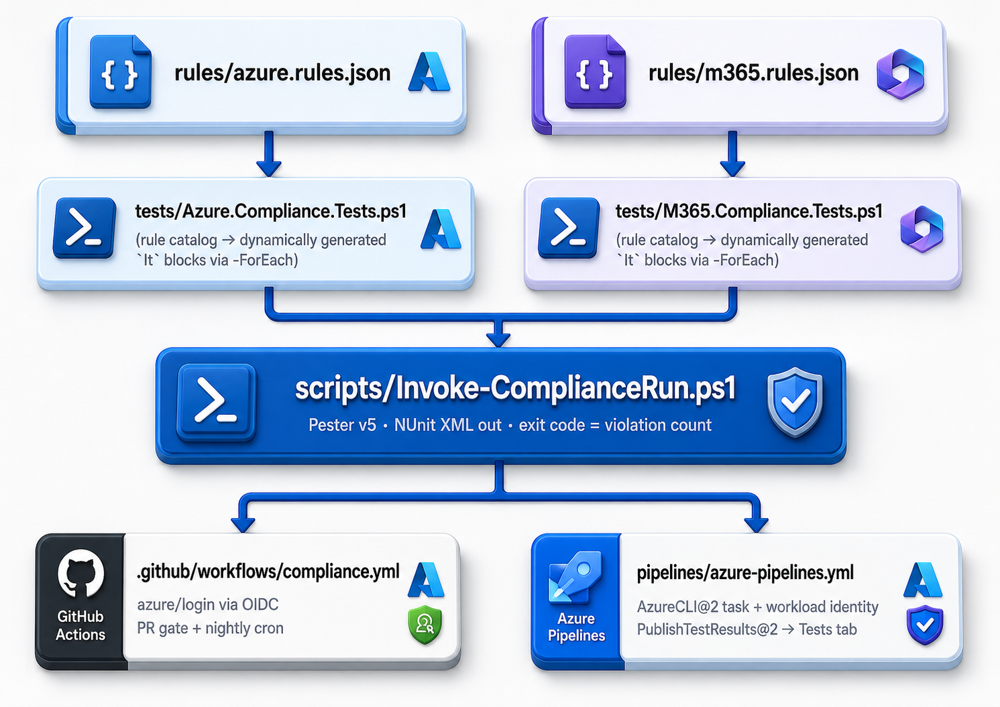

# Azure & M365 Compliance-as-Code Pipeline

Infrastructure compliance expressed as **Pester unit tests against live cloud state**, driven by a rule catalog in JSON and enforced in CI/CD. The pipeline connects to Azure (OIDC, no stored secrets) and Microsoft Graph (cert app-only), runs the test suite, publishes NUnit results to the pipeline UI, and **fails the build** when reality violates policy — the same red/green discipline applied to code, applied to cloud configuration.

## Purpose

Terraform answers "did we deploy what we declared?" — but most compliance failures happen *after* deployment: someone opens an NSG "temporarily," disables HTTPS-only on a storage account, or turns off a CA policy. This project closes that loop: the rule catalog is the contract, Pester is the auditor, and the pipeline runs it on every PR and on demand (`workflow_dispatch`). Pester + Graph + CI gating is a combination junior engineers almost never show — that's the point.

## Architecture



## Why dynamic tests from a JSON catalog

The naive version hard-codes assertions in the test file; adding a rule means editing PowerShell. Here the catalog is data:

```json
{ "id": "AZ-ST-01", "check": "supportsHttpsTrafficOnly", "expected": true,
  "severity": "critical", "description": "Storage accounts must enforce HTTPS-only traffic" }
```

…and the test file generates one `It` block per rule × resource via Pester's `-ForEach`. New rule = one JSON object in a PR, reviewed like any code change. The Tests tab shows `AZ-ST-01: stproddata supportsHttpsTrafficOnly` as an individually passing/failing case.

## Screenshots

**A new compliance control is a one-object pull request.** The diff below adds rule `AZ-ST-04` (storage accounts must disable shared-key access) — a new `critical` check — with zero PowerShell changes. The suite discovers it automatically on the next run.


<!-- TODO: replace with a real local run once a live Azure lab is connected.
     The hero shot is a RED run — AZ-ST-01 failing with its -Because message
     ("Storage accounts must enforce HTTPS-only traffic") — proving the suite
     detects post-deployment drift.

-->

## Rule coverage shipped

| Catalog | Rules |
|---|---|
| `azure.rules.json` | Required tags (owner/costCentre/environment) on all resources · storage HTTPS-only + min TLS 1.2 + no public blob access · no NSG rule allowing 0.0.0.0/0 inbound on 22/3389 · resources only in approved AU regions |
| `m365.rules.json` | Named CA policies exist & enabled · legacy auth blocked · SSPR enabled · guest invites restricted |

## Tech stack

- Pester v5 (discovery/run phases, `-ForEach` data-driven cases, tags for `critical`-only runs)
- Az PowerShell + Microsoft Graph SDK
- GitHub Actions (azure/login with **OIDC federated credentials** — zero stored cloud secrets) and Azure DevOps (workload identity service connection) — same tests, both pipelines
- NUnit XML → native test reporting in both CIs

## Repo structure

```
azure-compliance-as-code/
├── README.md
├── .gitignore
├── rules/
│   ├── azure.rules.json
│   └── m365.rules.json
├── tests/
│   ├── Azure.Compliance.Tests.ps1
│   ├── M365.Compliance.Tests.ps1
│   ├── ComplianceData.ps1          # live-vs-fixtures data layer
│   └── fixtures/                   # committed reference tenant (offline demo)
├── scripts/
│   └── Invoke-ComplianceRun.ps1
├── pipelines/
│   └── azure-pipelines.yml
├── .github/workflows/
│   └── compliance.yml
└── docs/
    └── screenshot-checklist.md
```

## Quick start

**Live run** — audits a real tenant:

```powershell
Install-Module Pester, Az.Accounts, Az.Resources, Az.Storage, Az.Network, Microsoft.Graph.Authentication -Scope CurrentUser
Connect-AzAccount; Connect-MgGraph -Scopes 'Policy.Read.All'   # interactive for local runs

./scripts/Invoke-ComplianceRun.ps1                      # everything
./scripts/Invoke-ComplianceRun.ps1 -Tag critical       # gate-worthy rules only
./scripts/Invoke-ComplianceRun.ps1 -Suite azure        # skip M365
```

**Offline demo** — no Azure account, no login. The suites run against a committed, known-compliant reference tenant in [`tests/fixtures/`](tests/fixtures) and go green, so anyone can reproduce the gate (this is also what CI does when no OIDC secrets are set):

```powershell
Install-Module Pester -Scope CurrentUser
$env:COMPLIANCE_DATA_SOURCE = 'fixtures'
./scripts/Invoke-ComplianceRun.ps1                      # 37 checks, all green
```

The live/fixtures switch lives in [`tests/ComplianceData.ps1`](tests/ComplianceData.ps1): the test files never call `Get-Az*` / Graph directly, they ask the data layer, which returns live results or fixtures based on `COMPLIANCE_DATA_SOURCE` (defaults to `live`).

## Design decisions

- **Tests read, never write.** A compliance check with write permissions is a finding in itself. Remediation is a human (or a separate, deliberately-scoped tool like [`azure-monitor-selfheal`](../azure-monitor-selfheal)).
- **Severity tags, not severity if-statements.** `critical` rules gate PRs; `warning` rules only fail the full on-demand run. The mechanism is Pester tags, not custom logic.
- **OIDC over secrets.** The GitHub workflow authenticates with federated credentials — nothing to rotate, nothing to leak in logs.
- **Live or fixtures, one code path.** The same suites audit a real tenant (when OIDC secrets are present) or a committed reference tenant (when they aren't), decided by `COMPLIANCE_DATA_SOURCE`. CI stays green and reproducible without a cloud account, while the live enforcement path is one secret away.
